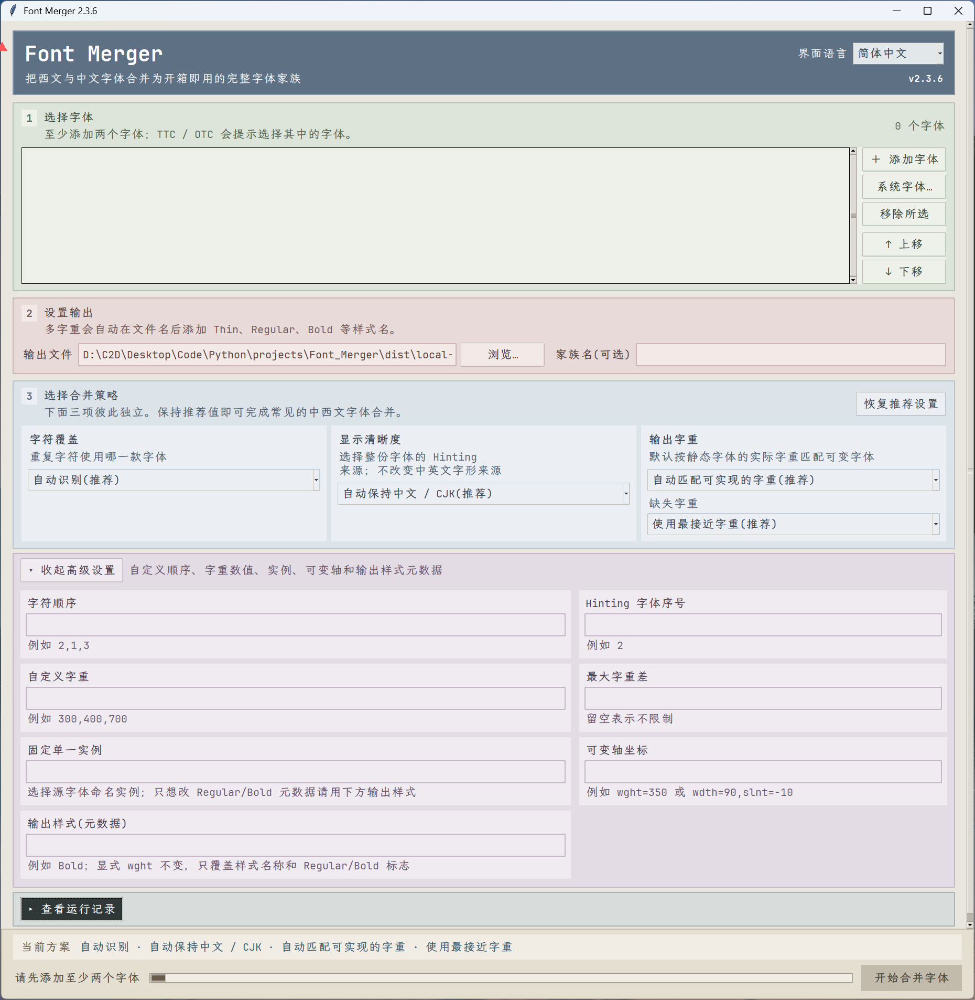

# Font_Merger

<p align="center">
  
</p>

<p align="center"><sub>图形界面 / Graphical interface / 圖形介面</sub></p>

> 将 🀄️:🦜（= 2:1 的等宽）双字体并集（纯英字体所有字符，覆盖中文字体中的对应部分），生成中 + 英双语单字体。
>
> Merge a 🀄️:🦜 dual-font pair (= 2:1 monospace), with every character from the Latin font overriding its counterpart in the Chinese font, into one bilingual font.
>
> 將 🀄️:🦜（= 2:1 等寬）的雙字型取聯集（純英文字型的所有字元覆蓋中文字型中的對應部分），生成中英雙語單一字型。

### VS Code


### Sublime Text


### SilverBullet


---

<a id="contents"></a>

## 目录 / Contents / 目錄

- **[简体中文](#zh-cn)**：[项目简介](#zh-cn-intro) · [功能亮点](#zh-cn-features) · [使用方法](#zh-cn-usage) · [下载](#zh-cn-download) · [GUI](#zh-cn-gui) · [命令行](#zh-cn-cli) · [微软雅黑](#zh-cn-yahei) · [Hinting](#zh-cn-hinting) · [多字重](#zh-cn-weights) · [安装与使用](#zh-cn-install) · [开发者](#zh-cn-dev) · [许可证](#zh-cn-license)
- **[English](#en)**: [Overview](#en-intro) · [Highlights](#en-features) · [Usage](#en-usage) · [Download](#en-download) · [GUI](#en-gui) · [CLI](#en-cli) · [Microsoft YaHei](#en-yahei) · [Hinting](#en-hinting) · [Multiple weights](#en-weights) · [Install and use](#en-install) · [Developers](#en-dev) · [License](#en-license)
- **[繁體中文](#zh-tw)**：[專案簡介](#zh-tw-intro) · [功能亮點](#zh-tw-features) · [使用方式](#zh-tw-usage) · [下載](#zh-tw-download) · [GUI](#zh-tw-gui) · [命令列](#zh-tw-cli) · [微軟雅黑](#zh-tw-yahei) · [Hinting](#zh-tw-hinting) · [多字重](#zh-tw-weights) · [安裝與使用](#zh-tw-install) · [開發者](#zh-tw-dev) · [授權](#zh-tw-license)

---

<a id="zh-cn"></a>

## 简体中文

<a id="zh-cn-intro"></a>

### 项目简介

**Font_Merger** 是一个字体合并工具，用于生成中英文（等宽）混排字体家族。

作为示例，它将 Inconsolata 的 1 等宽西文字符与 LXGW Bright 的 2 等宽中文字符，拼合成一个统一的英:中 = 1:2 等宽字体，并支持多字重和样式（Regular、Medium、Bold、Italic 等）。

- 合并一款西文字体和一款中文字体时，会自动让西文字体覆盖重复字符；输入顺序不影响结果。
- 支持 TTF、OTF、TTC 和 OTC，也可以依次合并多个字体。
- 支持微软雅黑等 `.ttc` 字体，无须预先拆分。
- 自动修改字体内部名称，避免与原字体冲突。
- 提供 Windows、Linux、macOS 单文件程序，无须安装 Python。
- 默认自动生成字体中可用的多个字重，也可以只选择一个字重。

<a id="zh-cn-features"></a>

### 功能亮点

1. **中英文混排优化**：作为示例，英文使用 Inconsolata，中文使用 LXGW Bright，保持视觉一致的 2:1 等宽比例。
2. **多字重支持**：可生成 Regular、Medium、Bold、Italic 等不同字重和样式的字体。
3. **字体集合支持**：可以直接选择 TTC/OTC 中的字体，例如微软雅黑。
4. **开箱即用**：下载程序即可合并，生成的字体可直接安装使用。

<a id="zh-cn-usage"></a>

### 使用方法

<a id="zh-cn-download"></a>

#### 下载

在 [Releases](https://github.com/ChenZhu-Xie/Font_Merger/releases) 下载适合你系统的文件：

- Windows：`font-merger-windows-x64.exe`
- Windows 图形界面：`font-merger-gui-windows-x64.zip`
- Linux：`font-merger-linux-x64`
- macOS：`font-merger-macos`

<a id="zh-cn-gui"></a>

#### GUI（Windows 推荐）

下载图形界面压缩包，解压后双击 `font-merger-gui-windows-x64.exe`。添加字体、选择输出位置，再点击“开始合并”即可。界面支持简体中文、繁體中文和 English。若 Windows 文件选择器不显示 `C:\Windows\Fonts`，可点击与“添加字体”并列的“系统字体…”，按家族名、样式或文件名搜索系统级和当前用户安装的字体，并用 Ctrl / Shift 多选；TTC / OTC 会直接列出其中的各个字体。

默认设置适合大多数用户：自动识别西文与 CJK 字体，让西文字体覆盖英文等重复字符，同时保留中文字体的其余字符，并以中文字体作为显示基准，避免中文笔画因缩放而变粗。程序还会自动匹配可实现的字重；例如静态西文字体为 350、中文可变字体支持 `wght=100..900` 时，会直接生成双方均为 350 的静态字体。手动填写 `wght=350` 或固定实例时，GUI 会自动停用与单一字重冲突的多字重选项。两款字体的添加顺序不影响识别结果。

<a id="zh-cn-cli"></a>

#### 命令行

把程序和字体放在同一文件夹，在该文件夹打开终端后运行：

```powershell
./font-merger-windows-x64.exe "Inconsolata-Medium.ttf" "LXGWBright-Medium.ttf" --family "Inconsolata-LXGWMono" --style Medium -o "Inconsolata-LXGWMono-Medium.ttf"
```

命令行默认使用相同的推荐策略。合并其他字体或三个以上字体时，则按输入顺序决定字符优先级。

<a id="zh-cn-yahei"></a>

##### 合并微软雅黑

TTC / OTC 是字体集合。先查看其中的字体：

```powershell
./font-merger-windows-x64.exe --list "C:\Windows\Fonts\msyh.ttc"
```

再选择要使用的序号，例如 `#0`：

```powershell
./font-merger-windows-x64.exe "Inconsolata-Medium.ttf" "C:\Windows\Fonts\msyh.ttc#0" --family "Inconsolata-YaHei" --style Medium -o "Inconsolata-YaHei-Medium.ttf"
```

> 路径中有 `#0` 时，请保留两边的英文双引号。

<a id="zh-cn-hinting"></a>

##### Hinting

一份字体只能安全使用一套 TrueType Hinting。中西文双字体默认以中文 / CJK 字体的 UPM 和 Hinting 为显示基准；这不会改变字形来源，英文和数字仍优先取自西文字体。源字体含可用 Hinting 时会优先保留。如果更在意西文 Hinting，可以加上：

```powershell
--hinting-source latin
```

也可以选择 `cjk`、`none` 或输入字体序号，例如 `--hinting-source 2`。

<a id="zh-cn-weights"></a>

##### 多字重

默认自动规则：

- 静态字体 + 可变字体：按静态字体的实际字重自动匹配 `wght`，如静态 350 自动匹配可变 350。
- 两款可变字体：生成双方均可实现的命名字重。
- Regular、Bold 分别合并时保持相同的家族名，安装后即可自动切换真正的粗体。
- DemiLight、Medium 等扩展字重也使用相同的家族名，同时在样式名和 `usWeightClass` 中保留实际字重，便于现代 Windows、CSS 等按字重选择。
- 这是面向现代字重选择的命名方式；只识别传统 Regular/Bold/Italic/Bold Italic 四成员家族的旧程序，可能无法完整列出扩展字重。
- 若希望 Markdown/CSS 的 `font-weight: bold` 使用真实粗体，建议同时生成并安装 700/Bold；如果只安装 350/500，最终选择 500 还是合成粗体取决于应用自身的字体匹配规则。

可用 `--list` 查看字体包含的实例：

```powershell
./font-merger-windows-x64.exe --list "C:\Windows\Fonts\NotoSansSC-VF.ttf"
```

`face #0` 只是 TTC / OTC 的字体序号，并非字重。需要手动覆盖时可写 `--axis wght=350`；默认情况下通常不必填写。

只需一个字重时明确指定实例：

```powershell
./font-merger-windows-x64.exe "consolab.ttf" "NotoSansSC-VF.ttf" --instance Bold --family "Consolas Noto Sans SC" -o "Consolas-Noto-Bold.ttf"
```

需要更多控制时，可用 `--weights latin`、`cjk`、`union`、`intersection` 或 `300,400,700`；`--weight-match exact` 可禁止使用相近字重替代。

<a id="zh-cn-install"></a>

#### 安装与使用

- Windows：双击 TTF 文件 → 点击“安装”
- macOS：双击 TTF 文件 → 安装到字体册
- Linux：拷贝到 `~/.local/share/fonts/` → 运行 `fc-cache -fv`

Sublime Text 的 `Preferences.sublime-settings`：

```json
{
    "font_face": "Inconsolata-LXGWMono",
    "font_size": 14
}
```

VS Code：管理 → 设置 → 搜索 `Font Family`：

```text
'Inconsolata-LXGWMono', 'Source Han Mono SC', Consolas, 'Courier New', monospace
```

<a id="zh-cn-dev"></a>

### 开发者

普通用户不需要安装 Python。源码运行方式：

```powershell
python -m pip install -e .
font-merger "Inconsolata-Medium.ttf" "LXGWBright-Medium.ttf" -o "merged.ttf"
```

GUI 使用 Python 标准库 Tkinter / ttk，字体处理使用 fontTools，并由 PyInstaller 打包为单文件程序。合并任务在后台线程运行；耗时主要取决于字体大小、字符数量和输出字重数量。

Windows 本地构建与测试：

```powershell
python -m pip install -e ".[build]"
.\build-windows.ps1
.\run-gui-debug.ps1
.\run-gui-release.ps1
```

Release 单文件输出到 `dist/local-release`；带控制台与 PyInstaller 调试信息的 onedir GUI 输出到 `dist/local-debug`。启动脚本可加 `-Build` 强制重新构建。

字体合并不会改变源字体许可证。分享合并后的字体前，请确认所有源字体都允许这样使用。

同类工具调研与技术说明见 [docs/research.md](docs/research.md)。

<a id="zh-cn-license"></a>

### 许可证

[GPL-3.0](LICENSE)

[返回目录](#contents)

---

<a id="en"></a>

## English

<a id="en-intro"></a>

### Overview

**Font_Merger** merges fonts into a family designed for mixed Chinese and Latin monospace text.

For example, it combines the single-width Latin glyphs of Inconsolata with the double-width Chinese glyphs of LXGW Bright to create a consistent 1:2 Latin-to-Chinese monospace font. Multiple weights and styles such as Regular, Medium, Bold, and Italic are supported.

- When merging one Latin font with one CJK font, Latin glyphs automatically override duplicate characters; input order does not matter.
- Supports TTF, OTF, TTC, and OTC files, plus sequential merging of multiple fonts.
- Uses `.ttc` fonts such as Microsoft YaHei directly, without extracting them first.
- Renames the merged font internally to avoid conflicts with its source fonts.
- Provides standalone Windows, Linux, and macOS programs; Python is not required.
- Generates all available weights by default, or a single selected weight when requested.

<a id="en-features"></a>

### Highlights

1. **Optimized mixed text**: for example, Inconsolata for Latin and LXGW Bright for Chinese preserve a visually consistent 2:1 monospace ratio.
2. **Multiple weights**: generate Regular, Medium, Bold, Italic, and other weights or styles.
3. **Font collections**: select a font directly from a TTC/OTC collection such as Microsoft YaHei.
4. **Ready to use**: download, merge, and install the generated font.

<a id="en-usage"></a>

### Usage

<a id="en-download"></a>

#### Download

Get the file for your system from [Releases](https://github.com/ChenZhu-Xie/Font_Merger/releases):

- Windows: `font-merger-windows-x64.exe`
- Windows GUI: `font-merger-gui-windows-x64.zip`
- Linux: `font-merger-linux-x64`
- macOS: `font-merger-macos`

<a id="en-gui"></a>

#### GUI (recommended on Windows)

Download and extract the GUI archive, then double-click `font-merger-gui-windows-x64.exe`. Add fonts, choose an output path, and click “Merge fonts.” The interface supports Simplified Chinese, Traditional Chinese, and English. If the Windows file picker does not show `C:\Windows\Fonts`, use “System fonts…” beside “Add fonts” to search system-wide and per-user fonts by family, style, or file name and select multiple entries with Ctrl / Shift. Each face in a TTC / OTC collection is listed directly.

The defaults suit most users. Font Merger detects Latin and CJK fonts automatically, lets the Latin font replace duplicate Latin glyphs, preserves the remaining Chinese glyphs, and uses the Chinese font as the display baseline so scaling does not make Chinese strokes heavier. It also matches realizable weights automatically; for example, a static Latin face at 350 makes a CJK variable font with `wght=100..900` instantiate at 350. When `wght=350` or a named instance is entered manually, the GUI disables conflicting multi-weight options automatically. The order of a Latin/CJK pair does not affect detection.

<a id="en-cli"></a>

#### Command line

Put the program and fonts in one folder, open a terminal there, and run:

```powershell
./font-merger-windows-x64.exe "Inconsolata-Medium.ttf" "LXGWBright-Medium.ttf" --family "Inconsolata-LXGWMono" --style Medium -o "Inconsolata-LXGWMono-Medium.ttf"
```

The CLI uses the same recommended defaults. For other combinations or three or more fonts, input order determines character priority.

<a id="en-yahei"></a>

##### Merge Microsoft YaHei

TTC and OTC files are font collections. First list the fonts inside:

```powershell
./font-merger-windows-x64.exe --list "C:\Windows\Fonts\msyh.ttc"
```

Then select an index such as `#0`:

```powershell
./font-merger-windows-x64.exe "Inconsolata-Medium.ttf" "C:\Windows\Fonts\msyh.ttc#0" --family "Inconsolata-YaHei" --style Medium -o "Inconsolata-YaHei-Medium.ttf"
```

> Keep the double quotes around a path that contains `#0`.

<a id="en-hinting"></a>

##### Hinting

A font can safely use only one set of TrueType hinting. For a Latin/CJK pair, the default uses the CJK font's UPM and hinting as the display baseline. This does not change glyph ownership: Latin letters and digits still come from the Latin font. Usable source hinting is preserved when possible. To prioritize Latin hinting instead, add:

```powershell
--hinting-source latin
```

You can also choose `cjk`, `none`, or an input font number such as `--hinting-source 2`.

<a id="en-weights"></a>

##### Multiple weights

Default automatic rules:

- Static + variable: the static face's actual weight selects the matching `wght`, such as static 350 selecting variable 350.
- Two variable fonts: generate named weights that both inputs can realize.
- When Regular and Bold are merged separately, keep the same family name so applications can select the real Bold automatically.
- Extended weights such as DemiLight and Medium also use the same family name while retaining their actual style name and `usWeightClass`, allowing modern Windows and CSS clients to select by weight.
- This naming favors modern weight selection. Legacy applications limited to four-member Regular/Bold/Italic/Bold Italic families may not enumerate every extended weight correctly.
- To make Markdown/CSS `font-weight: bold` use a real bold face, generate and install 700/Bold as well. If only 350/500 are installed, whether 500 is selected or bold is synthesized depends on the application's font-matching rules.

List the instances in a font with `--list`:

```powershell
./font-merger-windows-x64.exe --list "C:\Windows\Fonts\NotoSansSC-VF.ttf"
```

`face #0` is only the font index in a TTC/OTC collection, not a weight. Use `--axis wght=350` to override automatic matching; it is normally unnecessary.

To generate only one weight, select its instance explicitly:

```powershell
./font-merger-windows-x64.exe "consolab.ttf" "NotoSansSC-VF.ttf" --instance Bold --family "Consolas Noto Sans SC" -o "Consolas-Noto-Bold.ttf"
```

For more control, use `--weights latin`, `cjk`, `union`, `intersection`, or a list such as `300,400,700`. Use `--weight-match exact` to disable nearest-weight substitution.

<a id="en-install"></a>

#### Install and use

- Windows: double-click the TTF file → click “Install”
- macOS: double-click the TTF file → install it in Font Book
- Linux: copy it to `~/.local/share/fonts/` → run `fc-cache -fv`

In Sublime Text's `Preferences.sublime-settings`:

```json
{
    "font_face": "Inconsolata-LXGWMono",
    "font_size": 14
}
```

In VS Code, open Manage → Settings and search for `Font Family`:

```text
'Inconsolata-LXGWMono', 'Source Han Mono SC', Consolas, 'Courier New', monospace
```

<a id="en-dev"></a>

### Developers

Regular users do not need Python. To run from source:

```powershell
python -m pip install -e .
font-merger "Inconsolata-Medium.ttf" "LXGWBright-Medium.ttf" -o "merged.ttf"
```

The GUI uses Python's standard Tkinter/ttk library, font processing uses fontTools, and PyInstaller produces standalone executables. Merging runs in a background thread; performance mainly depends on font size, glyph count, and the number of output weights.

For local Windows builds and testing:

```powershell
python -m pip install -e ".[build]"
.\build-windows.ps1
.\run-gui-debug.ps1
.\run-gui-release.ps1
```

Release one-file executables are written to `dist/local-release`. The onedir GUI with a console and PyInstaller diagnostics is written to `dist/local-debug`. Add `-Build` to either launcher to force a rebuild.

Merging does not change the licenses of the source fonts. Before sharing a merged font, confirm that every source font permits that use.

See [docs/research.md](docs/research.md) for related-tool research and technical notes.

<a id="en-license"></a>

### License

[GPL-3.0](LICENSE)

[Back to contents](#contents)

---

<a id="zh-tw"></a>

## 繁體中文

<a id="zh-tw-intro"></a>

### 專案簡介

**Font_Merger** 是一款字型合併工具，用於產生適合中英文等寬混排的字型家族。

例如，它會將 Inconsolata 的單倍寬西文字元與 LXGW Bright 的雙倍寬中文字元，合成統一的英:中 = 1:2 等寬字型，並支援多種字重與樣式（Regular、Medium、Bold、Italic 等）。

- 合併一款西文字型與一款中文字型時，會自動讓西文字型覆蓋重複字元；輸入順序不影響結果。
- 支援 TTF、OTF、TTC 與 OTC，也能依序合併多個字型。
- 可直接使用微軟雅黑等 `.ttc` 字型，無須預先拆分。
- 自動修改字型內部名稱，避免與來源字型衝突。
- 提供 Windows、Linux、macOS 單一執行檔，無須安裝 Python。
- 預設自動產生字型中可用的多個字重，也可以只選擇一個字重。

<a id="zh-tw-features"></a>

### 功能亮點

1. **中英文混排最佳化**：例如英文使用 Inconsolata、中文使用 LXGW Bright，維持視覺一致的 2:1 等寬比例。
2. **多字重支援**：可產生 Regular、Medium、Bold、Italic 等不同字重與樣式。
3. **字型集合支援**：可直接選擇 TTC/OTC 中的字型，例如微軟雅黑。
4. **開箱即用**：下載程式即可合併，產生的字型可直接安裝使用。

<a id="zh-tw-usage"></a>

### 使用方式

<a id="zh-tw-download"></a>

#### 下載

前往 [Releases](https://github.com/ChenZhu-Xie/Font_Merger/releases) 下載適合你系統的檔案：

- Windows：`font-merger-windows-x64.exe`
- Windows 圖形介面：`font-merger-gui-windows-x64.zip`
- Linux：`font-merger-linux-x64`
- macOS：`font-merger-macos`

<a id="zh-tw-gui"></a>

#### GUI（Windows 推薦）

下載圖形介面壓縮檔，解壓縮後按兩下 `font-merger-gui-windows-x64.exe`。加入字型、選擇輸出位置，再按一下「開始合併字型」即可。介面支援簡體中文、繁體中文與 English。若 Windows 檔案選擇器未顯示 `C:\Windows\Fonts`，可按一下與「加入字型」並列的「系統字型…」，依家族名稱、樣式或檔名搜尋系統層級和目前使用者安裝的字型，並用 Ctrl / Shift 多選；TTC / OTC 會直接列出其中各個字型。

預設設定適合大多數使用者：自動辨識西文與 CJK 字型，讓西文字型覆蓋英文等重複字元，同時保留中文字型的其餘字元，並以中文字型作為顯示基準，避免中文筆畫因縮放而變粗。程式也會自動配對可實現的字重；例如靜態西文字型為 350、中文可變字型支援 `wght=100..900` 時，會直接產生雙方均為 350 的靜態字型。手動填寫 `wght=350` 或固定實例時，GUI 會自動停用與單一字重衝突的多字重選項。兩款字型的加入順序不影響辨識結果。

<a id="zh-tw-cli"></a>

#### 命令列

將程式與字型放在同一個資料夾，在該資料夾開啟終端機後執行：

```powershell
./font-merger-windows-x64.exe "Inconsolata-Medium.ttf" "LXGWBright-Medium.ttf" --family "Inconsolata-LXGWMono" --style Medium -o "Inconsolata-LXGWMono-Medium.ttf"
```

命令列預設使用相同的推薦策略。合併其他字型或三個以上字型時，則依輸入順序決定字元優先順序。

<a id="zh-tw-yahei"></a>

##### 合併微軟雅黑

TTC / OTC 是字型集合。先查看其中的字型：

```powershell
./font-merger-windows-x64.exe --list "C:\Windows\Fonts\msyh.ttc"
```

再選擇要使用的編號，例如 `#0`：

```powershell
./font-merger-windows-x64.exe "Inconsolata-Medium.ttf" "C:\Windows\Fonts\msyh.ttc#0" --family "Inconsolata-YaHei" --style Medium -o "Inconsolata-YaHei-Medium.ttf"
```

> 路徑中含有 `#0` 時，請保留兩側的英文雙引號。

<a id="zh-tw-hinting"></a>

##### Hinting

一份字型只能安全使用一套 TrueType Hinting。中西文雙字型預設以中文 / CJK 字型的 UPM 與 Hinting 作為顯示基準；這不會改變字形來源，英文與數字仍優先取自西文字型。來源字型含有可用的 Hinting 時會優先保留。若更重視西文 Hinting，可加入：

```powershell
--hinting-source latin
```

也可以選擇 `cjk`、`none` 或輸入字型編號，例如 `--hinting-source 2`。

<a id="zh-tw-weights"></a>

##### 多字重

預設自動規則：

- 靜態字型 + 可變字型：依靜態字型的實際字重自動配對 `wght`，例如靜態 350 自動配對可變 350。
- 兩款可變字型：產生雙方均可實現的命名字重。
- Regular、Bold 分別合併時保持相同家族名稱，安裝後即可自動切換真正的粗體。
- DemiLight、Medium 等延伸字重也使用相同家族名稱，同時在樣式名稱與 `usWeightClass` 中保留實際字重，方便現代 Windows、CSS 等依字重選擇。
- 這是偏向現代字重選擇的命名方式；只支援傳統 Regular/Bold/Italic/Bold Italic 四成員家族的舊程式，可能無法完整列出延伸字重。
- 若希望 Markdown/CSS 的 `font-weight: bold` 使用真正的粗體，建議同時產生並安裝 700/Bold；若只安裝 350/500，最終選擇 500 或合成粗體取決於應用程式本身的字型配對規則。

可用 `--list` 查看字型包含的實例：

```powershell
./font-merger-windows-x64.exe --list "C:\Windows\Fonts\NotoSansSC-VF.ttf"
```

`face #0` 只是 TTC / OTC 的字型編號，並非字重。需要手動覆蓋時可寫 `--axis wght=350`；預設情況通常不必填寫。

只需要一個字重時，請明確指定實例：

```powershell
./font-merger-windows-x64.exe "consolab.ttf" "NotoSansSC-VF.ttf" --instance Bold --family "Consolas Noto Sans SC" -o "Consolas-Noto-Bold.ttf"
```

需要更多控制時，可使用 `--weights latin`、`cjk`、`union`、`intersection` 或 `300,400,700`；`--weight-match exact` 可停用相近字重替代。

<a id="zh-tw-install"></a>

#### 安裝與使用

- Windows：按兩下 TTF 檔案 → 按一下「安裝」
- macOS：按兩下 TTF 檔案 → 安裝至「字體簿」
- Linux：複製至 `~/.local/share/fonts/` → 執行 `fc-cache -fv`

Sublime Text 的 `Preferences.sublime-settings`：

```json
{
    "font_face": "Inconsolata-LXGWMono",
    "font_size": 14
}
```

VS Code：管理 → 設定 → 搜尋 `Font Family`：

```text
'Inconsolata-LXGWMono', 'Source Han Mono SC', Consolas, 'Courier New', monospace
```

<a id="zh-tw-dev"></a>

### 開發者

一般使用者不需要安裝 Python。從原始碼執行的方式：

```powershell
python -m pip install -e .
font-merger "Inconsolata-Medium.ttf" "LXGWBright-Medium.ttf" -o "merged.ttf"
```

GUI 使用 Python 標準函式庫 Tkinter / ttk，字型處理使用 fontTools，並由 PyInstaller 打包為單一執行檔。合併工作會在背景執行緒中執行；耗時主要取決於字型大小、字元數量與輸出字重數量。

Windows 本機建置與測試：

```powershell
python -m pip install -e ".[build]"
.\build-windows.ps1
.\run-gui-debug.ps1
.\run-gui-release.ps1
```

Release 單一執行檔會輸出至 `dist/local-release`；含主控台與 PyInstaller 偵錯資訊的 onedir GUI 會輸出至 `dist/local-debug`。啟動腳本可加上 `-Build` 強制重新建置。

字型合併不會改變來源字型的授權條款。分享合併後的字型前，請確認所有來源字型都允許這種用途。

同類工具研究與技術說明請見 [docs/research.md](docs/research.md)。

<a id="zh-tw-license"></a>

### 授權

[GPL-3.0](LICENSE)

[返回目錄](#contents)
